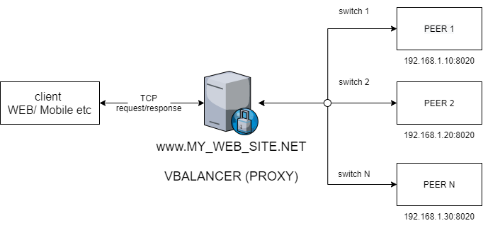

# VBalancer

The VBalancer has realized for switch traffic between peers, and it uses Robin Round algorithm.
This is an implementation need to increase stability and downgrade high load to backend.



## Important: need set ENV to run

To run need to set an environment os "ProxyPort" and path to config file "ConfigFile"

## Settings

On file: config/config.yaml you can add or delete peer(s), and configure PROXY settings.

## Docker

### build

```bash
$docker build --tag vbalancer . -f Dockerfile
```

### run

```bash
$docker run --rm -p 8080:8080 vbalancer
```
