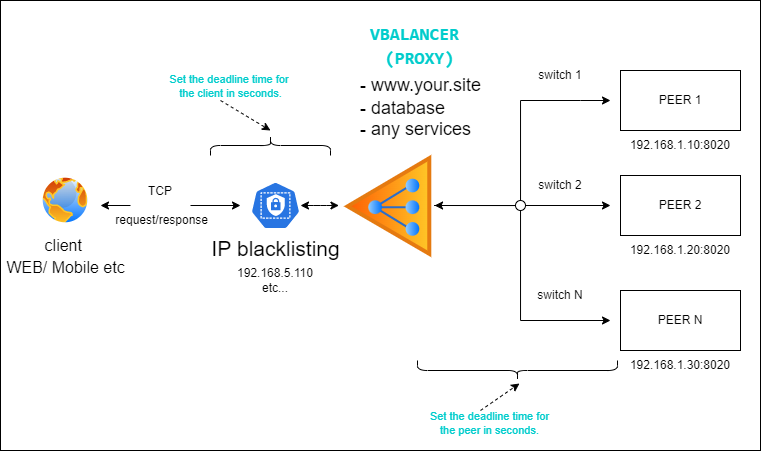

# VBalancer

The VBalancer has realized for switch traffic between peers, and it uses Robin Round algorithm.
This is implementation need to increase stability and downgrade high load to backend.

## Settings

In file: cmd/vbalancer/config.yaml you can add or delete peer(s), and configure PROXY settings.
